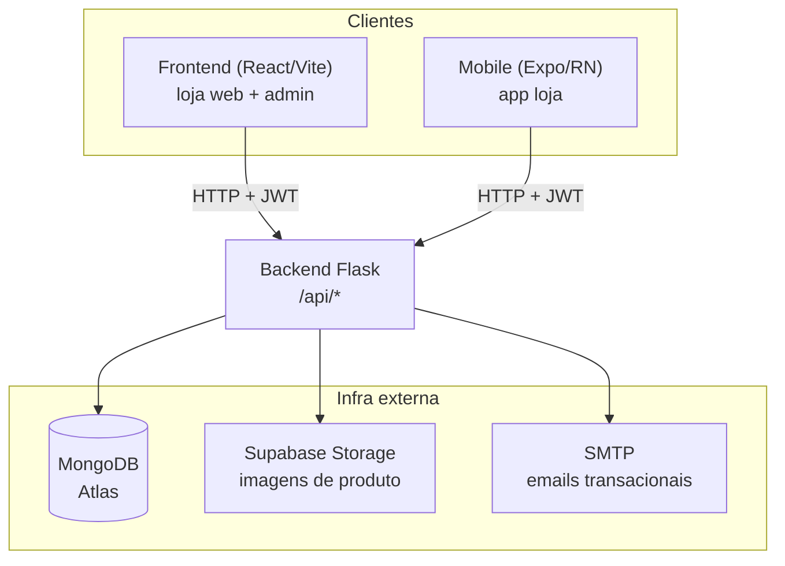
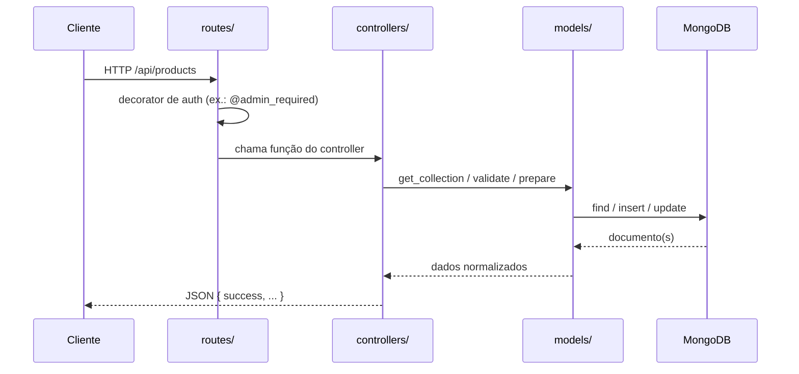
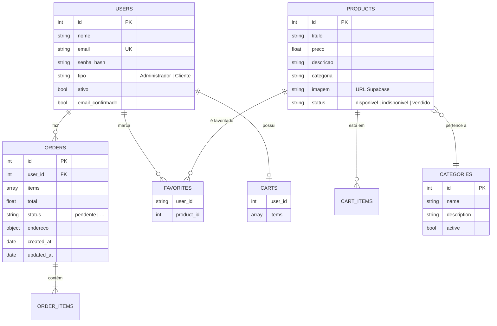
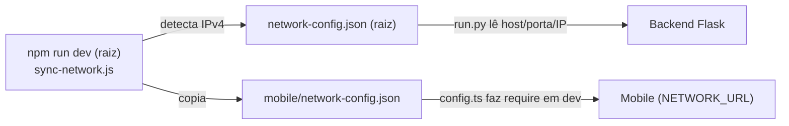

# Arquitetura

Este documento descreve **como o Luxus Brechó é organizado e como as partes conversam entre si**. O foco é dar a quem chega o modelo mental do sistema antes de entrar no código.

## Visão geral

O projeto é um **monorepo** com três aplicações que consomem a mesma API:

| Aplicação | Stack | Papel |
|-----------|-------|-------|
| `backend/` | Python 3.10+, Flask, MongoDB, JWT | Fonte única de verdade: regras de negócio, persistência e autenticação |
| `frontend/` | React 19, Vite 6, Zustand | Loja web (SPA) + painel administrativo |
| `mobile/` | Expo 49, React Native, TypeScript | App da loja para Android/iOS |

A regra mais importante do projeto: **o backend é a única fonte de verdade**. Frontend e mobile são clientes independentes — não compartilham código entre si, apenas o contrato da API. Toda validação de negócio (preço, categorias válidas, permissões) acontece no backend; os clientes replicam validações apenas para UX.



## Por que monorepo

As três aplicações evoluem juntas e dependem do mesmo contrato de API. Mantê-las no mesmo repositório permite:

- Alterar um endpoint e seus consumidores (web + mobile) no mesmo commit/PR.
- Compartilhar a **configuração de rede** (`network-config.json`) entre backend e mobile sem publicar pacotes.
- Ter scripts orquestradores na raiz (`npm run dev`, `dev:full`) que sobem o ambiente inteiro.

Cada app, porém, tem seu próprio gerenciador de dependências e ciclo de deploy — não há build unificado nem workspace de pacotes.

## Backend — camadas

O backend segue o padrão **app factory + blueprints**, com separação explícita em quatro camadas dentro de `backend/app/`:

```
routes/        →  Definem URL + método HTTP e aplicam decorators de auth
controllers/   →  Regras de negócio; leem request, validam, devolvem JSON
models/        →  Acesso ao MongoDB + ensure_*() de coleções/índices
services/      →  Capacidades transversais: JWT, email, storage
```



### O `create_app()` é o coração

`backend/app/__init__.py` concentra toda a inicialização. Ao subir, ele:

1. Configura **CORS** (origens vêm de `FRONTEND_ORIGIN`, ou um fallback embutido com localhost + domínios Vercel).
2. Habilita, **se as libs estiverem instaladas**, compressão gzip (`flask-compress`) e rate limiting (`flask-limiter`). Ambas são opcionais — o app sobe sem elas.
3. Conecta ao MongoDB e **chama `ensure_*()` de cada model** para garantir coleções e índices (inclusive índices únicos e de texto). Schema e índices são versionados em código, não criados manualmente no banco.
4. Registra os blueprints a partir de uma **lista declarativa** (`blueprints_to_register`). Cada import é tolerante a falha: um blueprint quebrado loga um aviso, mas não derruba a aplicação.
5. Define `app.url_map.strict_slashes = False` e handlers de erro globais (404/405/413/500) que sempre respondem JSON.

> **Implicação prática:** `app.db` pode ser `None` quando `MONGODB_URI` não está definido — o servidor ainda inicia. Endpoints que dependem do banco devem checar isso e responder `503`.

## Modelo de dados (MongoDB)

O banco usa **IDs inteiros sequenciais próprios** (campo `id`), gerados via coleção de contadores (`get_next_sequence` / `get_next_id`) — e não o `ObjectId` do Mongo, que é omitido nas respostas. Isso mantém URLs e payloads previsíveis (`/api/products/12`).



Pontos de modelagem que valem registrar:

- **Produto é peça única.** Não há quantidade por item de carrinho: um produto está ou não no carrinho. O `status` (`disponivel`/`indisponivel`/`vendido`) controla a disponibilidade.
- **Categorias são dinâmicas.** O `product_model` monta um schema de validação a partir das categorias **ativas** no banco (`create_dynamic_schema`), com cache. Criar uma categoria nova passa a permitir produtos nela sem mudar código.
- **Endereço do pedido** é um subdocumento obrigatório com `rua`, `numero`, `bairro`, `cidade`, `estado`, `cep`.
- Validação fica nos models: `validate_*`, `normalize_*` e `prepare_new_*` são o ponto único de regras de cada entidade.

## Autenticação e autorização

Existem **dois mecanismos de identificação** no backend — é importante saber qual cada rota usa:

| Mecanismo | Header | Onde é usado |
|-----------|--------|--------------|
| **JWT** (`Bearer`) | `Authorization: Bearer <token>` | Usuários (CRUD, troca de senha) e escrita de produtos (admin) |
| **X-User-Id** | `X-User-Id: <id>` | Favoritos (decorator `require_auth` próprio do controller) |

O serviço JWT (`services/jwt_service.py`) emite dois tokens:

- **Access token** — expira em **24h**, carrega `user_id`, `tipo` e `email`.
- **Refresh token** — expira em **30 dias**, usado em `/api/users/refresh-token` para renovar o access sem novo login.

Decorators disponíveis: `@jwt_required`, `@jwt_optional`, `@admin_required` e `@owner_or_admin_required('id')` (permite o próprio usuário **ou** um admin). Algoritmo `HS256`, segredo em `JWT_SECRET_KEY`.

> Cart e Orders identificam o usuário pelo `user_id` na própria URL e hoje não aplicam decorator de auth — um ponto a ter em mente ao endurecer a segurança.

## Frontend — SPA por features

```
src/
├─ pages/<Pagina>/    →  index.jsx + index.css co-localizados (rota = pasta)
├─ components/        →  UI reutilizável (Header, Footer, Skeleton, Modais, Toast)
├─ store/            →  Zustand: authStore, cartStore, favoritesStore
├─ services/         →  axios + wrappers por domínio
├─ schemas/          →  validação Zod
└─ hooks/            →  useDebounce, useToast, ...
```

Dois pontos estruturais:

- **`services/api.js` é uma instância axios única com interceptors.** O interceptor de request injeta o `Bearer` token (exceto em rotas de auth); o de response faz **refresh automático em `401`**, usando uma fila (`failedQueue`) para não disparar múltiplos refresh concorrentes — requisições que falharam são repetidas após o token renovar. Os demais arquivos de `services/` são wrappers finos por domínio sobre essa instância.
- **Stores Zustand orquestram efeitos cruzados.** Ex.: ao logar, o `authStore` dispara `useFavoritesStore.loadFavorites()`. A store é o lugar das ações assíncronas; as páginas consomem estado e disparam ações.

## Mobile — Expo Router + camada de rede

```
app/                →  Rotas por arquivo (Expo Router). (tabs)/ = abas; [id].tsx = dinâmica
components/          →  ecommerce/, forms/, ui/
constants/config.ts →  CONFIG central (tudo via env EXPO_PUBLIC_*)
services/api.ts     →  ApiService com timeout, retry/backoff e cache (AsyncStorage)
schemas/            →  Zod + hooks/useZodForm.ts
```

- **`constants/config.ts`** centraliza toda configuração e a torna ajustável por variáveis `EXPO_PUBLIC_*`. `getApiUrl()` decide a URL conforme o ambiente: produção usa `PRODUCTION_URL`; desenvolvimento usa a `NETWORK_URL` (o IP da máquina na rede local).
- **`services/api.ts`** implementa retry com backoff e **cache local de respostas GET** via AsyncStorage, com tempos configuráveis por recurso (produtos, categorias).

## Configuração de rede entre dispositivos

Testar o mobile em um aparelho físico exige que ele alcance o backend pelo IP da máquina na Wi-Fi. Isso é resolvido por um arquivo gerado e compartilhado:



`network-config.json` **não é versionado** (use `network-config.example.json` como referência). Ao trocar de rede, rode `npm run dev` de novo e reinicie o Metro com `--clear`. Detalhes operacionais em [setup-e-deploy.md](./setup-e-deploy.md).

## Serviços externos

| Serviço | Uso | Configuração |
|---------|-----|--------------|
| **MongoDB (Atlas)** | Persistência principal | `MONGODB_URI`, `MONGODB_DATABASE` |
| **Supabase Storage** | Hospedagem de imagens de produto | `SUPABASE_URL`, `SUPABASE_KEY`, `SUPABASE_BUCKET` |
| **SMTP** | Emails transacionais (confirmação de conta, recuperação de senha, status de pedido) | bloco `SMTP_*`, `FROM_EMAIL`, `FROM_NAME` |

O upload de imagem é coordenado pelo backend: o `products_controller`/rota `with-image` envia o arquivo ao Supabase, recebe a URL pública e grava apenas a URL no documento do produto. Ao excluir um produto, a imagem associada também é removida do storage.

## Deploy

Backend e frontend são publicados na **Vercel**, cada um com seu `vercel.json`:

- **Backend** — `@vercel/python` sobre `index.py`, que reexporta o app Flask; todas as rotas caem no mesmo handler serverless.
- **Frontend** — SPA estática com rewrite de `/(.*)` para `/index.html` (roteamento client-side do React Router).
- **Mobile** — distribuído via Expo/EAS (`eas.json`), fora da Vercel.
