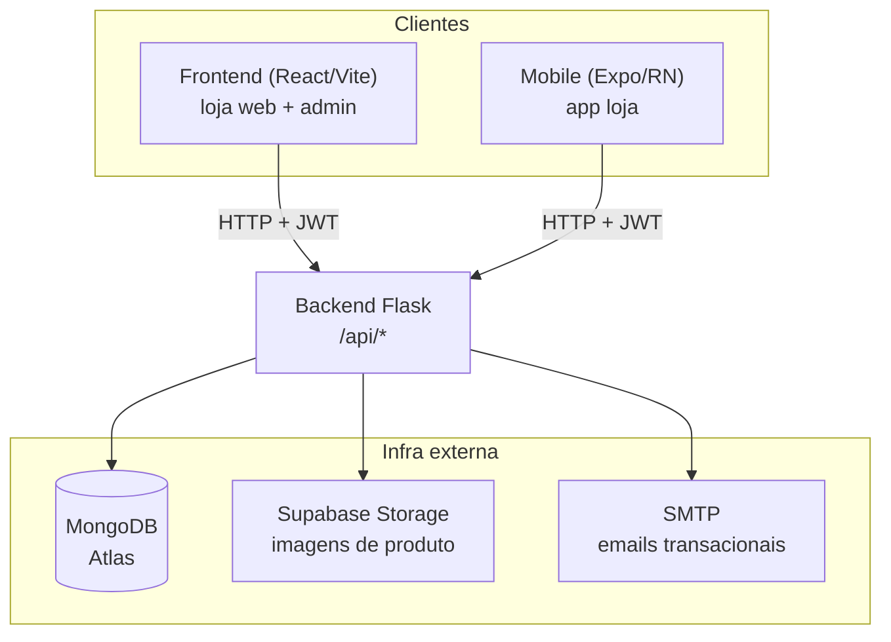
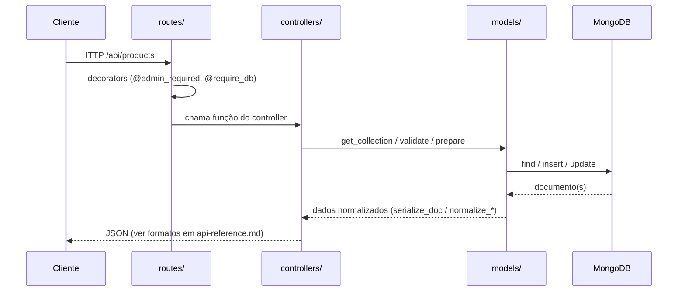
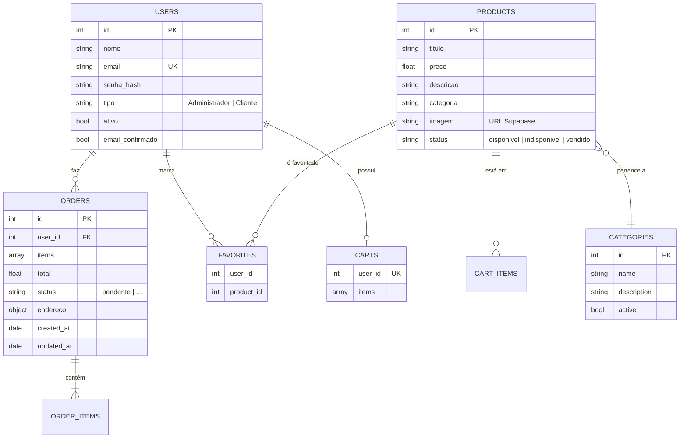
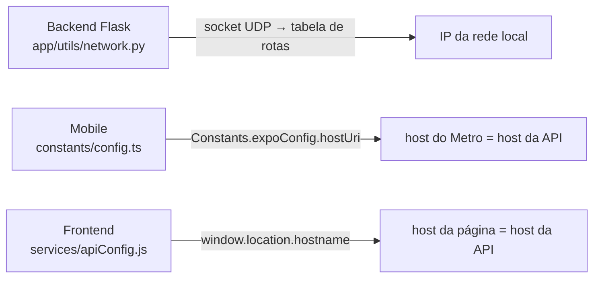

# Arquitetura

> Fonte: `backend/app/` · `frontend/src/` · `mobile/` · scripts da raiz
> Divergências conhecidas: [alinhamento-e-debitos.md](./alinhamento-e-debitos.md)

Este documento descreve **como o Luxus Brechó é organizado e como as partes conversam entre si**. O foco é dar a quem chega o modelo mental do sistema antes de entrar no código. O detalhe interno de cada app está em [`docs/apps/`](./apps/backend.md); o contrato da API em [api-reference.md](./api-reference.md).

## Visão geral

O projeto é um **monorepo** com três aplicações que consomem a mesma API:

| Aplicação | Stack | Papel |
|-----------|-------|-------|
| `backend/` | Python 3.10+, Flask, MongoDB, JWT | Fonte única de verdade: regras de negócio, persistência e autenticação |
| `frontend/` | React 19, Vite 6, Zustand | Loja web (SPA) + painel administrativo |
| `mobile/` | Expo 49, React Native, TypeScript | App da loja para Android/iOS |

A regra mais importante do projeto: **o backend é a única fonte de verdade**. Frontend e mobile são clientes independentes — não compartilham código entre si, apenas o contrato da API. Toda validação de negócio (preço, categorias válidas, permissões) acontece no backend; os clientes replicam validações apenas para UX.

Ambos os clientes usam **JWT** (Bearer + refresh em 401) e acompanham o grosso do contrato atual, com resíduos pontuais — no web, o `X-User-Id` legado em favoritos; no mobile, o mesmo resíduo em favoritos e o carrinho que ainda modela `quantity`. O mapa completo está na [matriz de alinhamento](./alinhamento-e-debitos.md#matriz-de-alinhamento).



## Por que monorepo

As três aplicações evoluem juntas e dependem do mesmo contrato de API. Mantê-las no mesmo repositório permite:

- Alterar um endpoint e seus consumidores (web + mobile) no mesmo commit/PR.
- Compartilhar **scripts de desenvolvimento** (sincronização de rede, orquestração dos apps) sem publicar pacotes.
- Ter scripts orquestradores na raiz que sobem o ambiente (ver [Scripts da raiz](#scripts-da-raiz)).

Cada app, porém, tem seu próprio gerenciador de dependências e ciclo de deploy — não há build unificado nem workspace de pacotes.

## Backend — camadas

O backend segue o padrão **app factory + blueprints**, com separação em cinco camadas dentro de `backend/app/`:

```
routes/        →  Definem URL + método HTTP e aplicam decorators de auth
controllers/   →  Regras de negócio; leem request, validam, devolvem JSON
models/        →  Acesso ao MongoDB + ensure_*() de coleções/índices
services/      →  Capacidades transversais: JWT, email, storage
utils/         →  Helpers canônicos: require_db, serialize_doc, parse_pagination, cache
```

Exceções ao padrão: **produtos** e **health** têm a lógica inline no próprio arquivo de rota (não há `products_controller.py` — a duplicata antiga era código morto e foi removida).



### O `create_app()` e o ciclo de boot

`backend/app/__init__.py` concentra toda a inicialização. Ao subir, ele:

1. Configura **CORS** (origens de `FRONTEND_ORIGIN` em CSV, ou fallback embutido com localhost + domínios Vercel). `Authorization` é header permitido; `X-User-Id` não é.
2. Habilita, **se as libs estiverem instaladas**, compressão gzip (`flask-compress`) e rate limiting (`flask-limiter`, storage via `RATELIMIT_STORAGE_URI` — default `memory://` com warning para produção). Ambas são opcionais.
3. Conecta ao MongoDB e **chama `ensure_*()` de cada model**: cria coleções, aplica validators JSON Schema (o de produtos é **dinâmico** — o enum de `categoria` vem das categorias ativas) e cria índices. Atenção: o `ensure_categories_collection` dropa e recria os índices da coleção a cada boot ([BE-07](./alinhamento-e-debitos.md#be-07)). Ao final, `ensure_users_collection` chama `create_default_admin`, que **semeia o primeiro admin a partir de `ADMIN_EMAIL`/`ADMIN_PASSWORD`** — sem essas env vars não há seed.
4. Registra os blueprints a partir de uma lista declarativa (`blueprints_to_register`). Todos são **obrigatórios**: uma falha de import lança `RuntimeError` e aborta o startup (fail-fast — nada de API mutilada em silêncio).
5. Define `app.url_map.strict_slashes = False` e handlers de erro globais (404/405/413/500) que respondem `{"success": false, "message": ...}`.

Além do boot da factory, o **import** de `services/jwt_service.py` já falha rápido se `JWT_SECRET_KEY` não estiver definida — o app não sobe sem ela.

> **Implicação prática:** `app.db` pode ser `None` quando `MONGODB_URI` não está definido — o servidor ainda inicia. As rotas que tocam o banco usam o decorator `@require_db` (`utils/db.py`) e respondem `503` canônico nesse cenário.

## Modelo de dados (MongoDB)

O banco usa **IDs inteiros sequenciais próprios** (campo `id`), gerados via coleção de contadores (`counters`, com `$inc` atômico) — e não o `ObjectId` do Mongo, que é omitido nas respostas. Isso mantém URLs e payloads previsíveis (`/api/products/12`).



### Índices por coleção

| Coleção | Índices (fonte: `models/*.py`) |
|---------|-------------------------------|
| `products` | `uniq_id` (único em `id`) · `idx_categoria` · `txt_titulo_descricao` (TEXT em `titulo`+`descricao`) |
| `users` | únicos em `id` e `email` · `tipo` · `ativo` · TEXT em `nome` · **esparsos** em `token_confirmacao` e `reset_token` |
| `categories` | `uniq_id` (único) · `uniq_name` (único parcial) · `idx_active` — recriados a cada boot |
| `favorites` | `user_product_unique` (**único composto** `user_id`+`product_id`) · `user_created` · `product_idx` |
| `carts` | `user_id_unique` (**único** — um carrinho por usuário) |
| `orders` | `order_id_unique` (único em `id`) · `user_orders_by_date` (`user_id`+`created_at` desc) · `order_status` |
| `counters` | `uniq_name` (único em `name`) |

Pontos de modelagem que valem registrar:

- **Produto é peça única.** Não há quantidade por item de carrinho ou pedido: um produto está ou não no carrinho, e o total do pedido é a soma dos preços. O `status` controla a disponibilidade.
- **Categorias são dinâmicas.** O `product_model` monta o validator a partir das categorias **ativas** no banco (`create_dynamic_schema`), com cache TTL de 5 min (`utils/cache.py`). Criar uma categoria nova passa a permitir produtos nela sem mudar código.
- **Endereço do pedido** é um subdocumento obrigatório com `rua`, `numero`, `bairro`, `cidade`, `estado`, `cep`.
- Validação fica nos models: `validate_*`, `normalize_*` e `prepare_new_*` são o ponto único de regras de cada entidade. `coerce_product_id` (em `cart_model`) é a barreira anti-injeção de operador NoSQL.

## Autenticação e autorização

Há **um único mecanismo de identificação**: JWT via `Authorization: Bearer <access_token>`. O antigo header `X-User-Id` de favoritos foi removido do backend (clientes que ainda o enviam: ver [débitos](./alinhamento-e-debitos.md#matriz-de-alinhamento)).

O serviço JWT (`services/jwt_service.py`) emite dois tokens:

- **Access token** — expira em **24h**; claims `sub` (id), `type`, `email`.
- **Refresh token** — expira em **30 dias**; usado em `POST /api/users/refresh-token` para renovar o par sem novo login.

Algoritmo **HS256 fixo no código** (a env `JWT_ALGORITHM` é ignorada — [BE-05](./alinhamento-e-debitos.md#be-05)); segredo em `JWT_SECRET_KEY` (obrigatória, fail-fast).

Decorators: `@jwt_required`, `@jwt_optional`, `@admin_required` e `@owner_or_admin_required('<param>')`. Todos com **frescor de privilégio**: releem `tipo`/`ativo` do banco a cada requisição — conta desativada ou admin rebaixado perdem acesso na requisição seguinte, sem esperar o token expirar. Detalhes e formatos de erro em [api-reference.md](./api-reference.md#autenticação).

Cobertura por recurso (o detalhe rota a rota está em [`docs/api/`](./api-reference.md#índice-de-recursos)):

| Recurso | Leitura | Escrita |
|---------|---------|---------|
| Produtos, categorias, imagens | pública | `@admin_required` |
| Carrinho | posse (`@owner_or_admin_required`) | posse |
| Pedidos | posse (na rota ou no controller) | posse; mudança de status só admin |
| Favoritos | `@jwt_required` (identidade = token) | `@jwt_required` |
| Usuários | dono ou admin | dono ou admin; exclusão de conta em 2 passos autenticados |

## Frontend — SPA por features

```
src/
├─ pages/<Pagina>/    →  index.jsx + index.css co-localizados (rota = pasta)
├─ components/        →  UI reutilizável (Header, Footer, Skeleton, Modais, Toast)
├─ store/             →  Zustand: authStore, cartStore, favoritesStore
├─ services/          →  axios + wrappers por domínio
├─ schemas/           →  validação Zod
└─ hooks/             →  useDebounce, useToast, ...
```

Dois pontos estruturais:

- **`services/api.js` é uma instância axios única com interceptors.** O de request injeta o `Bearer` token (exceto em rotas de auth); o de response faz **refresh automático em `401`**, com fila (`failedQueue`) para não disparar múltiplos refresh concorrentes.
- **Stores Zustand orquestram efeitos cruzados.** Ex.: ao logar, o `authStore` dispara `useFavoritesStore.loadFavorites()`.

Detalhes (páginas, stores, testes e resíduos conhecidos) em [apps/frontend.md](./apps/frontend.md).

## Mobile — Expo Router + camada de rede

```
app/                 →  Rotas por arquivo (Expo Router). (tabs)/ = abas; [id].tsx = dinâmica
components/          →  ecommerce/, forms/, ui/
constants/config.ts  →  CONFIG central (tudo via env EXPO_PUBLIC_*)
services/api.ts      →  ApiService com timeout, retry/backoff e cache (AsyncStorage)
schemas/             →  Zod + hooks/useZodForm.ts
```

- **`constants/config.ts`** centraliza a configuração via `EXPO_PUBLIC_*`. A `getApiUrl()` efetivamente usada vem de `utils/networkUtils.ts` (produção → `PRODUCTION_URL`; dev → `NETWORK_URL`, derivada do host do dev server).
- **`services/api.ts`** implementa retry com backoff e **cache local de respostas GET** via AsyncStorage.

**Importante:** o mobile agora usa JWT (Bearer + refresh), mas ainda carrega resíduos — favoritos anexam o header legado `X-User-Id` (ignorado pelo backend) e o carrinho modela `quantity`. O estado real está em [apps/mobile.md](./apps/mobile.md) e na [matriz de alinhamento](./alinhamento-e-debitos.md#matriz-de-alinhamento).

## Configuração de rede entre dispositivos

Testar o mobile em um aparelho físico exige que ele alcance o backend pelo IP da máquina na Wi-Fi. Cada app descobre esse endereço no momento em que sobe, sem arquivo intermediário:



O `network-config.json` gerado por `npm run dev` **não é versionado** e hoje é apenas um override opcional: o backend respeita `host`/`port` dele, e o mobile o usa como fallback quando não há dev server. Trocar de rede não exige regenerá-lo.

Duas premissas dessa derivação: o Metro roda na mesma máquina que o backend (com `expo start --tunnel` ela não vale — use `EXPO_PUBLIC_NETWORK_URL`), e o emulador Android é tratado como caso especial (`hostUri` reporta `localhost` via `adb reverse`, então cai para `10.0.2.2`). Racional completo em [decisions.md § ADR-0001](./decisions.md#adr-0001--cada-app-descobre-o-endereço-da-api-por-conta-própria); detalhes operacionais em [setup-e-deploy.md](./setup-e-deploy.md).

## Scripts da raiz

O `package.json` da raiz é só orquestração (não tem dependências de app):

| Script | O que faz |
|--------|-----------|
| `npm run dev` | `sync-network.js` — gera/copia `network-config.json` (override opcional; não é mais pré-requisito) |
| `npm run dev:full` | `start-dev.js` — sobe **backend + mobile** (não o frontend web) |
| `npm run backend` / `frontend` / `mobile` | sobe cada app individualmente |

## Serviços externos

| Serviço | Uso | Configuração |
|---------|-----|--------------|
| **MongoDB (Atlas)** | Persistência principal | `MONGODB_URI`, `MONGODB_DATABASE` |
| **Supabase Storage** | Hospedagem de imagens de produto | `SUPABASE_URL`, `SUPABASE_KEY`, `SUPABASE_BUCKET` |
| **SMTP** | Emails transacionais (confirmação de conta, recuperação de senha, código de exclusão, status de pedido) | bloco `SMTP_*`, `FROM_EMAIL`, `FROM_NAME` |

O upload de imagem é coordenado pelo backend: a rota `POST /api/products/with-image` envia o arquivo ao Supabase, recebe a URL (signed, 1 ano) e grava apenas a URL no documento do produto. Ao excluir um produto, a imagem associada também é removida do storage.

## Deploy

Backend e frontend são publicados na **Vercel**, cada um com seu `vercel.json`:

- **Backend** — `@vercel/python` sobre `index.py`, que reexporta o app Flask; todas as rotas caem no mesmo handler serverless.
- **Frontend** — SPA estática com rewrite de `/(.*)` para `/index.html` (roteamento client-side do React Router).
- **Mobile** — distribuído via Expo/EAS (`eas.json`), fora da Vercel.
